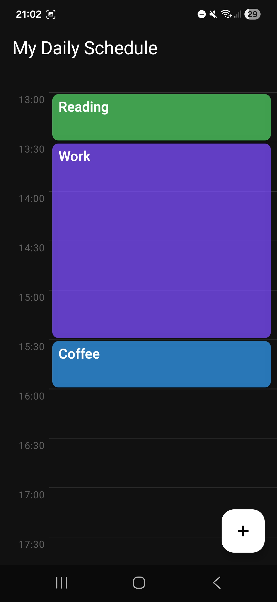
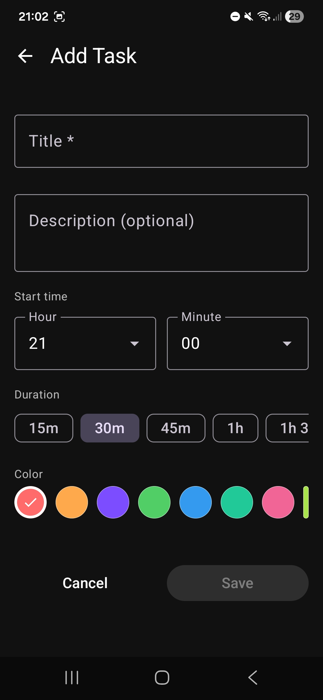
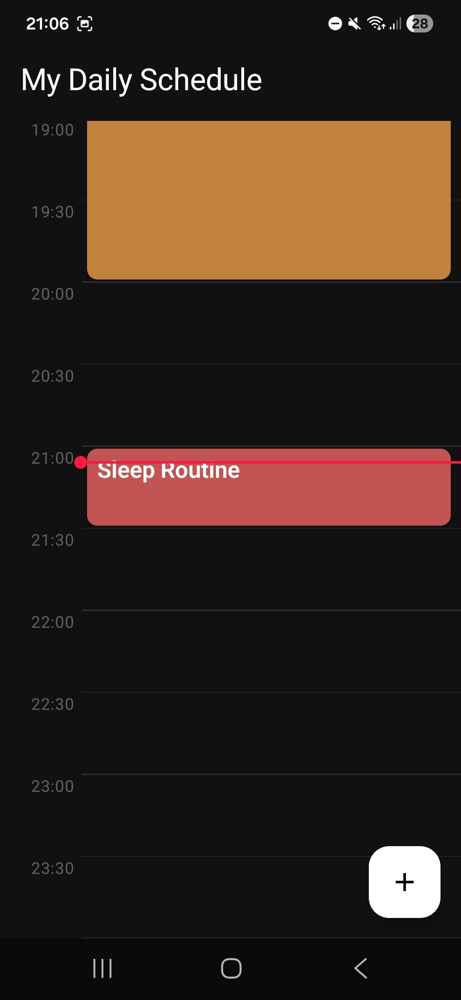

# 📅 MyDailySchedule

MyDailySchedule is an Android application designed to help you organize and visualize your daily tasks on a 24-hour timeline. You can schedule tasks with custom colors and durations, track real-time progress, and even check upcoming tasks directly from your home screen widget.

  
  
  

## 🛠 Architecture
This app was developed using the [MVVM](https://developer.android.com/topic/architecture) architecture pattern with a Repository layer for data abstraction.
 
Inside the single module, the structure is divided in four main packages:
- `data` - Room entities, DAOs, database and repository
- `ui` - screens, viewModels and reusable components
- `widget` - Glance-based home screen widget
- `di` - dependency injection modules

## 📚 Libraries & Tools
- [Jetpack Compose](https://developer.android.com/compose) - Declarative UI framework
- [Room](https://developer.android.com/training/data-storage/room) - Local SQLite database with Flow support
- [Koin](https://insert-koin.io/) - Dependency injection
- [Navigation Compose](https://developer.android.com/guide/navigation/navigation-compose) - In-app navigation
- [Glance](https://developer.android.com/jetpack/compose/glance) - Home screen widget built with Compose
- [Material 3](https://m3.material.io/) - Design system and UI components
- [Coroutines](https://kotlinlang.org/docs/coroutines-overview.html) - Asynchronous operations
